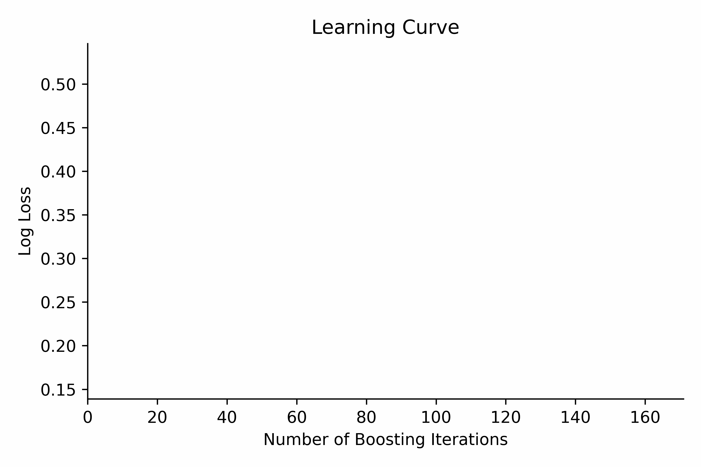

# Scorecard Boosting 🚀

Welcome to the Scorecard Boosting repository! 🎉

* Scorecard boosting is an innovative methodology for constructing credit scorecards by leveraging advanced Machine Learning (ML) techniques, specifically gradient boosting.

* Boosted scorecards allow to improve performance metrics like Gini score and Kolmogorov-Smirnov (KS) statistic, while maintaining the interpretability of traditional scorecards. 📊 This is achieved by combining the best of both worlds: the interpretability of scorecards and the predictive power of gradient boosting. 🌐

* A boosted scorecard can be seen as a collection of sequential decision trees transformed into a traditional scorecard format. 🌲 This scorecard comprises rules essential for computing a score, an evaluative measure of an applicant's creditworthiness or an existing customer. Typically ranging from 300 to 850, this score can be further customized using the Points to Double the Odds (PDO) technique, a concept extendable to gradient boosted decision trees.

## Repository Contents 📚

This repository contains a collection of notebooks and scripts that demonstrate how to build boosted scorecards.

- `scorecard-boosting-demo`: example of a boosted scorecard with XGBoost
- `xgb_scorecard_constructor`: example of a boosted scorecard with XGBoost and the `xgb_scorecard_constructor` package (WIP)
- `other_notebooks`: other notebooks that demonstrate how to build scorecards with various Machine Learning techniques

> 🛠️ This work draws upon and extends the [code](https://github.com/rapidsai-community/showcase/tree/main/event_notebooks/GTC_2021/credit_scorecard) from the [presentation](https://www.nvidia.com/en-us/on-demand/session/gtcspring21-s31327/) "Machine Learning in Retail Credit Risk: Algorithms, Infrastructure, and Alternative Data — Past, Present, and Future [S31327]" by Paul Edwards, Director, Data Science and Model Innovation at Scotiabank and Weights & Biases' notebooks [Interpretable Credit Scorecards with XGBoost](https://colab.research.google.com/github/wandb/examples/blob/master/colabs/boosting/Credit_Scorecards_with_XGBoost_and_W%26B.ipynb).

## Useful resources 📖

- [Boosting for Credit Scorecards and Similarity to WOE Logistic Regression](https://github.com/pedwardsada/real_adaboost/blob/master/real_adaboost.pptx.pdf)
- [Machine Learning in Retail Credit Risk: Algorithms, Infrastructure, and Alternative Data — Past, Present, and Future](https://www.nvidia.com/ko-kr/on-demand/session/gtcspring21-s31327/)
- [Building Credit Risk Scorecards with RAPIDS](https://github.com/rapidsai-community/showcase/tree/main/event_notebooks/GTC_2021/credit_scorecard)
- [XGBoost for Interpretable Credit Models](https://wandb.ai/tim-w/credit_scorecard/reports/XGBoost-for-Interpretable-Credit-Models--VmlldzoxODI0NDgx)
- [`credit_scorecard` - Project](https://wandb.ai/morgan/credit_scorecard/overview)
- [`vehicle_loan_defaults` - Artifacts 📊](https://wandb.ai/morgan/credit_scorecard/artifacts/dataset/vehicle_loan_defaults/v1)