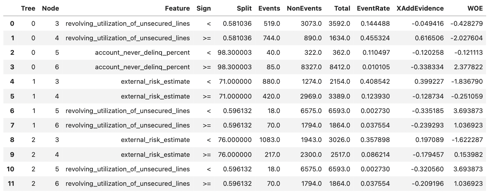

# XGB Scorecard Constructor

**Author:** Denis Burakov ([GitHub](http://github.com/deburky))

### Description

This Python class is designed to generate a scorecard from a trained XGBoost model.

In this early version, it can be seen as an extension of `trees_to_dataframe()` method in XGBoost similar to Decision Tree (number of samples, class counts etc) or Weight-of-Evidence (WOE) summaries in [OptBinning](https://gnpalencia.org/optbinning/index.html). It also reuses the codebase from `xgb2sql` library for creating full tree split tracebacks. Possibly, SQL deployment of an XGBoost scorecard will be added in the future.

Future enhancements will include employing a Points to Double the Odds (PDO) technique for scorecard point assignment and integrating explainability features to enhance the interpretability of the model. The methodology behind this class is inspired by the NVIDIA GTC Talk "Machine Learning in Retail Credit Risk" by Paul Edwards ([GitHub](https://github.com/pedwardsada)).

<blockquote>
This preliminary version of the scorecard constructor is still under optimization for performance, but it provides a foundation for developing a more comprehensive and robust scorecard generation tool.
</blockquote>

## Versioning

| Version | Date | Changes |
|---|---|---|
| **v1.0** | 2024-01-18 | Initial version |
| **v1.1** | 2024-01-19 | Added detailed split information for trees with `max_depth > 1` |

### Parameters

| Parameter | Type | Description |
|---|---|---|
| `xgb_model` | `xgboost.XGBClassifier` | A trained XGBoost classification model |
| `X_train` | `pd.DataFrame` | Features of the training data used to train the XGBoost model |
| `y_train` | `pd.Series` | Labels of the training data |

### Methods

| Method | Description |
|---|---|
| `extract_leaf_weights()` | Extracts leaf weights from the XGBoost model |
| `construct_scorecard()` | Constructs the scorecard based on the extracted leaf weights and a binning summary |

### Example Usage

```python
# Instantiate the XGBScorecardConstructor
scorecard_constructor = XGBScorecardConstructor(
    xgb_model, 
    X_train, 
    y_train
)

# Construct the scorecard
xgb_scorecard = scorecard_constructor.construct_scorecard()

# Print the scorecard
print(xgb_scorecard)
```



## Version: `v1.1`

**File:** `xgb_scorecard_constructor_with_splits.py`

**Changes:** 

- Inclusion of a detailed split for trees with `max_depth > 1`. The splits reported for trees with a `max_depth > 1` may be misleading as they show only leaf nodes and do not show the full tree structure. 
- The new option `print_splits` prints the full traceback of the tree for each leaf node.

To enable this option, use the following code:

```python
from xgb_scorecard_constructor_with_splits import XGBScorecardConstructor
scorecard_constructor = XGBScorecardConstructor(
    xgb_model, 
    X_train, 
    y_train
)
# Construct the scorecard
xgb_scorecard = scorecard_constructor.construct_scorecard(print_splits=True)
# Print the scorecard
print(xgb_scorecard)
```
